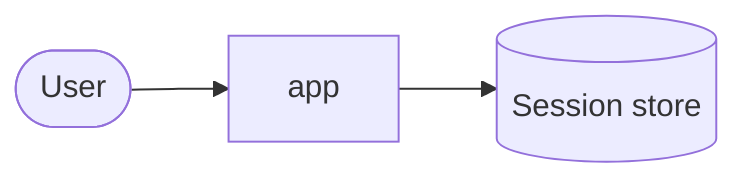
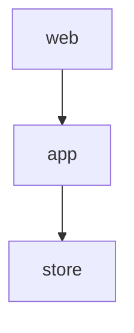
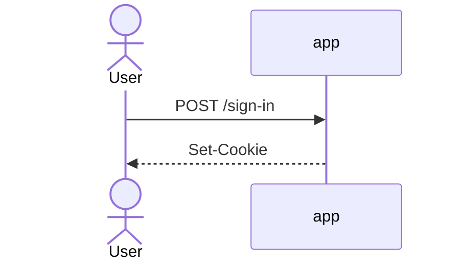

# Architecture — Auth flow

## Overview

Sessions are signed tokens in a cookie.

## Diagrams

### Context

```mermaid
flowchart LR
  user([User]) --> app[app]
  app --> store[(Session store)]
```

### Layers

```mermaid
flowchart TB
  web --> app
  app --> store
```

### Flow: sign in

```mermaid
sequenceDiagram
  actor U as User
  participant A as app
  U->>A: POST /sign-in
  A-->>U: Set-Cookie
```
